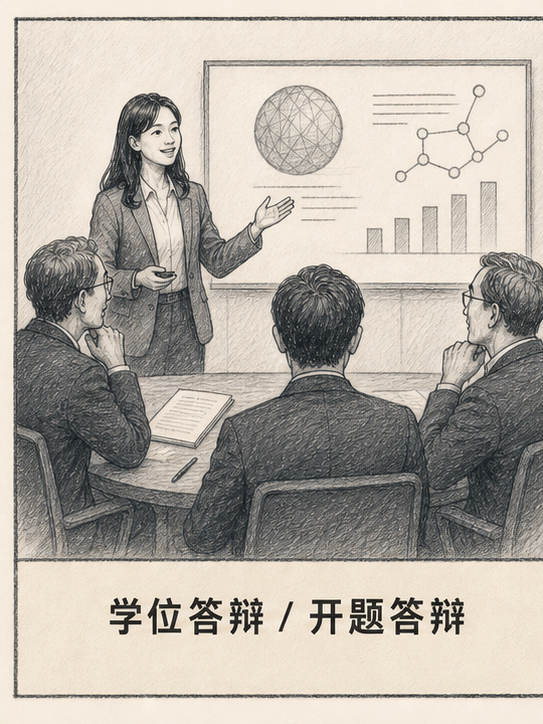
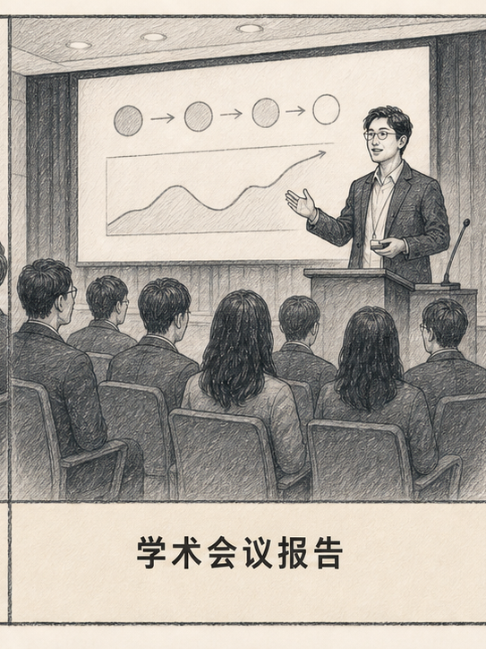
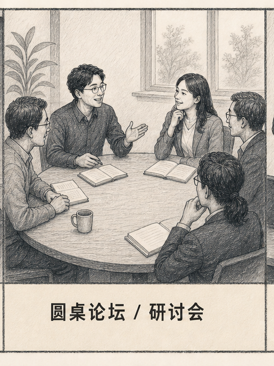
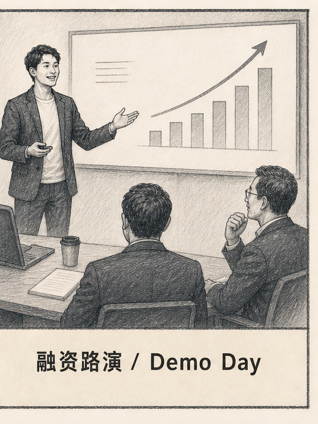

<div align="center">

# ppt-to-speech

**把你的 PPT 变成你真正能开口说的东西。**

「幻灯片做完了，不知道嘴上怎么说。」


ppt-to-speech 帮你把做好的幻灯片转化为可直接朗读的逐字稿，标注每张幻灯片的时长，将脚本写回 .pptx 备注栏，并生成一份 Q&A 备战手册——涵盖新手、专家、质疑者三类听众可能提出的问题。

[使用场景](#使用场景) · [跟直接问 ChatGPT 的区别](#跟直接问-chatgpt-的区别) · [安装](#使用方法) · [理论依据](#理论依据) · [目录结构](#目录结构)

---

**Other Languages:**

[English](README.md)

</div>

---

## 支持场景

<table width="100%" cellspacing="0" cellpadding="0" border="0">
<tr>
<td width="25%" align="center" valign="top">
<br><br>
<strong>说服式辩护</strong><br><br>
听起来你在立论，而不是在念稿
</td>
<td width="25%" align="center" valign="top">
<br><br>
<strong>每句话感知时间</strong><br><br>
核心放慢、过渡加速、不留空档
</td>
<td width="25%" align="center" valign="top">
<br><br>
<strong>对话式，非演讲式</strong><br><br>
别人说完，你知道接什么
</td>
<td width="25%" align="center" valign="top">
<br><br>
<strong>叙事弧线驱动</strong><br><br>
结论先于数字，情绪带着听众走
</td>
</tr>
</table>

<div align="center"><sub>同一份 PPT，场景不同，说话方式就不同——脚本风格随场景而变，而不是套用同一个模板。</sub></div>

## 使用方法

安装 skill 后，把 PPT 发给 Claude，然后说：

🎓 **答辩**
> "这是我的开题答辩 PPT，下周五答辩，限时 10 分钟，中文讲。帮我写逐字稿，再准备评委可能问的问题。"

📊 **会议报告**
> "这是我的 AERA 投稿 PPT，18 张，给了 12 分钟。帮我先规划哪几张可以压缩，再写完整报告稿。"

🗣️ **圆桌 / 研讨会**
> "下周有个教育技术的圆桌，这是我准备的幻灯片。不需要逐字稿，帮我整理一套可以随时调用的论点，加上开场说什么。"

🚀 **路演**
> "这是我们的融资 PPT，Demo Day 上台 5 分钟硬截止。帮我写完整路演稿，再准备投资人最可能刁难的问题。"

输出物：一份 Markdown 排练文档 + 一份把脚本写入备注栏的 PPT 副本（原文件永不修改）。

## 跟"直接问 ChatGPT"的区别

- **绝不复述幻灯片内容。** 听众自己会看；脚本只补充幻灯片无法呈现的东西——推理过程、过渡逻辑、重点强调。
- **时间估算经得起推敲。** 字数与语速（英文 ≈140 词/分钟，中文 ≈200 字/分钟）核对后才给出，时间分配有意不均——核心幻灯片获得 2–3 倍时长。
- **Q&A 让你有点不舒服，但这是好事。** 三类提问人分别出题（新手 / 专家 / 质疑者），直击演讲中最薄弱的论点，并附模范回答和不同场景下如何优雅说"我不知道"。
- **尊重你的原创内容。** 已有备注视作作者意图；纯图片幻灯片会向你提问，绝不臆造内容。

## 理论依据

每个场景的脚本逻辑各有来源，不共用同一套框架。

---

**🎓 学位答辩 / 开题答辩**

**Toulmin 论证模型 — Q&A 备战**

答辩被追问时最常见的窘境，不是不知道答案，而是结论说出去了，支撑结论的推理没说。Toulmin 把一个论点拆成六层（主张→数据→论据→支撑→限定词→反驳条件），评委最爱追问的那一层是"你凭什么从这个数据得出这个结论"。脚本提前把这层说出来，追问的入口就少了一个。

**Hyland 元话语理论 — 措辞分寸**

答辩里用错一个动词就会被抓住。"We prove that…"在没有实验支持时说出口，是直接送分给评委。Hyland 的研究给出校准原则：观察数据说 *suggests*，相关研究说 *indicates*，实验数据才能说 *demonstrates*；没有因果设计就不能用 *leads to*，只能说 *is associated with*。

**Swales CARS 模型 — 开场结构**

很多人开场就讲背景，评委听了两分钟还不知道"你在研究什么"。CARS 模型给出三步：说这个领域在做什么（建立领域）→ 说现有研究缺什么（找到缺口）→ 说你填补了什么（占据缺口）。前 45 秒按这个顺序说完，评委一开口就知道你的研究位置。

---

**📊 学术会议报告**

| 作用 | 文献 |
|---|---|
| **不复述幻灯片** | Mayer, R. E. (2009). *Multimedia Learning* (2nd ed.). Cambridge University Press. |
| **口语句式设计** | Sweller, J. (1988). Cognitive load during problem solving. *Cognitive Science*, 12(2), 257–285. |
| **幻灯片与脚本分工** | Alley, M. (2013). *The Craft of Scientific Presentations* (2nd ed.). Springer. |
| **开场钩子** | Monroe, A. H. (1935). *Principles and Types of Speech*. Scott, Foresman. |

- **不复述幻灯片**：Mayer 的冗余原则证明口头重复屏幕文字会加重认知负担。脚本只写幻灯片上没有的内容——推理、转折、强调。
- **口语句式设计**：Sweller 的认知负荷理论说明听觉处理有成本，脚本的句子比论文更短，核心幻灯片放慢语速，让听众的工作记忆有余地跟上。
- **幻灯片与脚本分工**：Alley 的断言-证据框架——主张写在幻灯片上，推理和证据在脚本里，两者不重叠，各自承担不同的信息层。
- **开场钩子**：即使是学术听众也需要在前 30 秒获得一个继续听下去的理由。Monroe 的注意力步骤指导脚本用结果或悖论开场，而不是从"今天我要讲……"开始。

---

**🗣️ 圆桌论坛 / 研讨会**

| 作用 | 文献 |
|---|---|
| **立场清晰度** | Aristotle. *Rhetoric*. |
| **Speaker positioning** | Hyland, K. (2005). *Metadiscourse: Exploring Interaction in Writing*. Continuum. |
| **论点单元设计** | Sweller, J. (1988). 同上. |

- **立场清晰度**：Aristotle 的 ethos 理论——公信力来自愿意说出一个可被反驳的立场。脚本帮你把"我觉得这很重要"变成具体可争辩的观点。
- **Speaker positioning**：圆桌上每句话都在标记你与议题、与其他发言者的关系。Hyland 的研究指导脚本预先确定每个立场的措辞方向。
- **论点单元设计**：听众同时跟踪多位发言者，认知负载更高。Sweller 的理论要求每条论点自成一个完整单元，不依赖上下文也能被独立理解。

---

**🚀 融资路演 / Demo Day**

| 作用 | 文献 |
|---|---|
| **叙事弧线结构** | Monroe, A. H. (1935). *Principles and Types of Speech*. Scott, Foresman. |
| **Q&A 备战权重** | Chen, X.-P., Yao, X., & Kotha, S. (2009). Entrepreneur passion and preparedness in business plan presentations. *Academy of Management Journal*, 52(1), 199–214. |
| **情绪驱动逻辑** | Duarte, N. (2010). *Resonate: Present Visual Stories that Transform Audiences*. Wiley. |

- **叙事弧线结构**：Monroe 的 Motivated Sequence（注意→需求→满足→可视化→行动）直接对应路演的钩子→痛点→方案→牵引力→融资请求，确保听众的情绪和逻辑同步推进。
- **Q&A 备战权重**：Chen et al. 的研究证明 VC 的决策更受准备充分度影响，而非创始人当场的激情。这是路演脚本把单位经济、护城河、最难回答的问题放在与正稿同等重要位置的依据。
- **情绪驱动逻辑**：Duarte 的对比结构（现状 vs 未来）说明听众的行动意愿由情绪弧线驱动，而非数据堆砌。脚本在数字幻灯片前后设计情绪的高低切换。

## 目录结构

```
ppt-to-speech/
├── SKILL.md                       # 工作流 + 场景路由
├── references/
│   ├── academic/
│   │   ├── thesis-defense.md
│   │   ├── conference-talk.md
│   │   └── panel-discussion.md
│   ├── founding-pitch.md
│   └── qa-preparation.md          # 三类提问人方法论
└── scripts/
    ├── extract_slides.py          # pptx → JSON（文字、表格、图片 alt-text、现有备注）
    └── write_notes.py             # 脚本 JSON → 备注栏（非破坏性写入）
```

两个辅助脚本需要安装 `python-pptx`。

## 许可证

MIT
